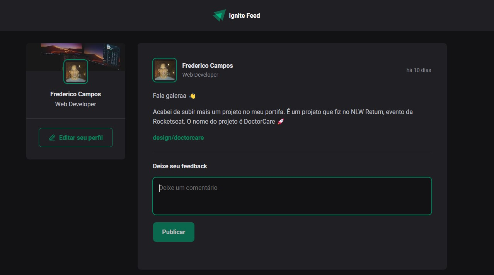
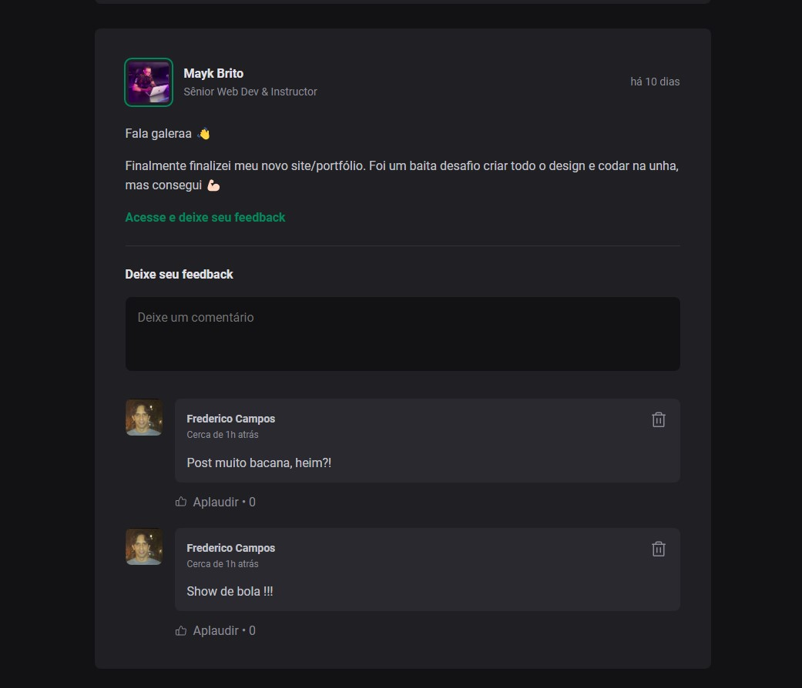

<h1 align="center">Ignite Feed</h1>

## Descrição do Projeto

<p >Foi desenvolvido uma página de feed similar a de uma rede social com posts, comentários e likes. Projeto desenvolvido no curso da [Rocketseat](https://rocketseat.com.br).</p></br>

## Tecnologias


</br>
</br>

## Modo de usar

- Clonar o repositório

```
  git clone https://github.com/fredcsouza/ignite-feed
```

- Instalar dependências

```
  npm install
```

- Executar a aplicação

```
  npm run dev
```

</br>
</br>

## Screenshots



